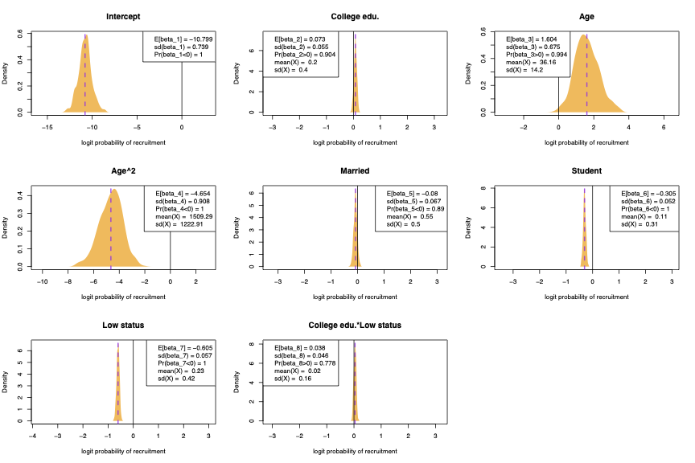

# is_cc

Replication materials for "Explaining Recruitment to Extremism: A Bayesian Contaminated Case Control Approach."

- 00_isis_analysis_egypt.R : estimate Egypt "Worm's Eye" model
- 01_isis_analysis_tunisia.R : estimate Tunisia "Worm's Eye" model
- 02_isis_analysis_all.R : estimate cross-national "Bird's Eye" model
- 03_isis_plot_egypt.R : reproduce main text figures for Egypt
- 04_isis_plot_tunisia.R : reproduce main text figures for Tunisia
- 05_isis_plot_all.R : reproduce main text figures and tables for cross-national

Note: need to run scripts in order. Scripts 01--02 produce files named "full_fit_<>.RData," which contain the estimation results for each of the Egypt, Tunisia, and cross-national models. Files "cleaned.<>.RData" contain shortened versions of the combined Arab Barometer and recruits data. Raw individual-level data, including e.g. home address and other recruitment characteristics, not included in these replication materials to preserve anonymity. 

Full manuscript can be found in "paper.pdf."
